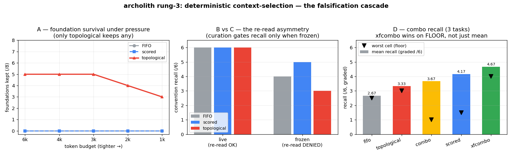

# Rung 3 — Deterministic Context-Selection Experiments (START HERE)

This directory is the experimental arm of the archolith **deterministic-layers** research thread:
*does ordering which files survive a budget-truncated context briefing change what an LLM agent
recalls and produces?* It is a sequence of pre-registered experiments, each of which **killed a
hypothesis and sharpened the question** — read the arc, not just the files.

Canonical results record: `archolith/.agent/RESEARCH-FINDINGS.md` §G–§I.
Direction/spine: `archolith/.agent/plans/archolith-context-deterministic-layers-direction.md`.

**Reproduce the whole offline arm in one command:** `python rung3/run_offline.py`
(corpus characterization → Phase A → profiler → graded re-score → metric self-check → figure;
no API, no metered cost. Override paths via `ARCHOLITH_CORPUS` / `ARCHOLITH_CONTEXT_ROOT`).

## Results at a glance

Recall metric = `feature_contract.py` (F1–F6 anchors; "core" = page+hook+data-layer+css all present).
Fill strategies: **FIFO** (insertion order), **scored** (keyword relevance), **topological** (dependency
in-degree, foundations-first), **combo** (exemplar-aware: guarantee a template, then interleave).

| Phase | Question | Regime | Headline result |
|-------|----------|--------|-----------------|
| **A** (offline) | Does topological keep load-bearing FOUNDATIONS under budget pressure? | frozen, mechanical | **Yes** — topological 3–5/8 foundations survive; FIFO & scored **0/8**. |
| **B** (live) | Does that help an agent's recall in a real run? | live agent, re-read allowed | **No difference** — all 3 arms **6/6**. The agent RE-READ source; the filesystem, not the briefing, gated recall. |
| **C** (frozen) | With re-reading DENIED, which fill recalls conventions best? | frozen briefing, 1 task | **Inverse of A**: topological **WORST (3/6)**, FIFO 4/6, scored **BEST (5/6)**. Foundations ≠ recall-critical; recall needs an EXEMPLAR. |
| **C-multi** | Is that ranking robust across tasks? | frozen, 3 tasks | topological flat-low (3.00); scored high-variance (6/0/5 — **0/6 when it picks a non-exemplar**); FIFO 3.33. No pure fill is reliable. |
| **D** (combo) | Can a COMBO beat the pure strategies? | frozen, 3 tasks | **Yes, but only the exemplar-aware combo**: xfcombo **4.67/6, no catastrophic cell**; naive interleave (3.00) does NOT beat scored. |
| **profiler** | Can the exemplar marker be DERIVED, not hardcoded? | offline, 4 corpora | **Yes** on template-convention corpora (derives `Page.tsx`); cleanly empty elsewhere. Foundations (in-degree) generalize universally. |

## The arc (the falsification cascade — this is the actual finding)

1. **Hypothesis:** topological fill (protect foundations) should improve recall. (From the offline sweep
   in `../RESULT-pressure-sweep.md`.)
2. **Phase A** confirms the *mechanism*: topological is the only strategy that keeps foundations alive
   under pressure. So far so good.
3. **Phase B** (live) **falsifies the recall claim**: all arms tie, because a tool-using agent re-reads
   source and bypasses the briefing entirely. → curation's value on file-backed tasks is **cost/latency,
   not recall**.
4. **Phase C** (deny re-reading to isolate the briefing) **inverts A**: topological is the *worst* for
   recall. In-degree finds *foundations*; convention recall needs an *exemplar* (a complete template to
   imitate). **"Foundation ≠ recall-critical."**
5. **Phase C-multi** shows no *pure* strategy is reliable — scored finds the exemplar only when the
   query's vocabulary happens to match one (it scored 0/6 when it didn't).
6. **Phase D** resolves it: an **exemplar-aware combo** (guarantee a structural template survives, then
   layer relevance + foundations) wins with no catastrophic failure. Each ingredient does a distinct
   job: EXEMPLAR = the template, scored = relevance, topological = foundations.
7. **Profiler** removes the combo's one hardcoded knob: the exemplar marker is **derivable** from the
   corpus's own repetition (validated across React/Java/TS/Python — fires on template-convention
   corpora, empty otherwise).

Net thesis (see `RESEARCH-FINDINGS §I`): the deterministic layers' defensible value is **mechanical
guarantees + economics, not live recall**; CONTENT selection is subvertible by re-reading, while
MAP and PRIMING are not (and MAP is **not yet surfaced at all** — the open frontier, see
`../../../.agent/plans/archolith-context-code-map-surface-plan.md`).

## Files

**Protocol & results** (read in arc order above):
`PROTOCOL-rung3-pressure.md` · `RESULT-phaseA-offline.md` · `RESULT-phaseB-metric.md` ·
`RESULT-phaseB-live.md` · `RESULT-phaseC-frozen-briefing.md` · `RESULT-phaseC-multi.md` ·
`RESULT-phaseD-combo.md` · `RESULT-profile-miner.md` · `RESULT-profile-generalization.md` ·
`RESULT-exemplar-signals-exploration.md` · `RESULT-graded-rescore.md` (ceiling-effect check)

**Scripts** (paths via `paths.py` — override with `ARCHOLITH_CORPUS` / `ARCHOLITH_CONTEXT_ROOT` env vars):
| script | phase | offline? |
|--------|-------|----------|
| `analyze_corpus.py` | corpus characterization | yes |
| `phase_a_foundation_survival.py` | A | yes |
| `feature_contract.py` | recall metric (+ B/C/D scorer) | yes |
| `phase_c_frozen_briefing.py` | C | **metered** (DeepSeek) |
| `phase_c_multi.py` | C-multi | **metered** |
| `phase_d_combo.py` | D | **metered** |
| `derive_profile.py` | profiler | yes |
| `explore_exemplar_signals.py` | signal probe | yes |
| `rescore_graded.py` | graded re-score of committed outputs | yes |
| `make_figure.py` | regenerate `figure-cascade.png` | yes |
| `run_offline.py` | **one-command driver for all offline steps** | yes |
| `paths.py` | shared path resolver (env-overridable) | — |

## Provenance & reproducibility

| field | value |
|-------|-------|
| corpus | `forked/yawn.frontend/src` @ `75ca56b` (real Astro+TSX app, 275 src files) |
| 2nd/3rd corpora (profiler generalization) | `opencode/packages/opencode/src` (TS), `archolith-context/archolith_proxy` (Python), `yawn.rip/src/main/java` (Java) |
| metered model | DeepSeek `deepseek-chat` via `api.deepseek.com/v1`, `temperature=0.2`, `max_tokens=4000` |
| offline deps | the `archolith-context` package importable (resolved by `paths.py`); matplotlib for the figure |
| paths | `ARCHOLITH_CORPUS` / `ARCHOLITH_CONTEXT_ROOT` env overrides; workspace-relative defaults |

**Seed honesty (important):** the committed Phase B/C/D result *docs* describe runs made BEFORE `seed`
was added (seed=7 landed in `ad67f38`), so those historical numbers are **unseeded single draws**.
`seed=7` (and `phase_d_multiseed.py`'s `seed ∈ {7,8,9}`) make *future* reruns reproducible — do not
back-date a seed onto the historical results.

**Sample size:** the original phase cells were **N=1**; the load-bearing Phase-D ranking is now
**confirmed at N=9** (3 seeds × 3 tasks, `RESULT-phaseD-multiseed.md`): xfcombo wins on mean (5.00),
floor (4.0), AND variance (stdev 0.71) — the exemplar guarantee removes catastrophic cells. Still
**open:** a 2nd-corpus *recall* confirm (the profiler's exemplar-*detection* generalization across 4
corpora is done; recall generalization is not).
